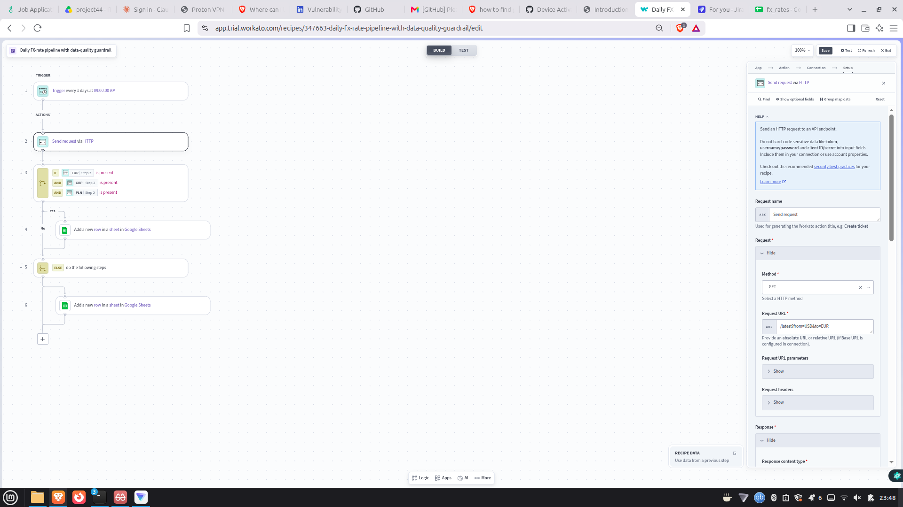
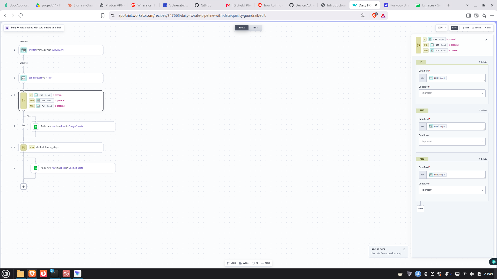
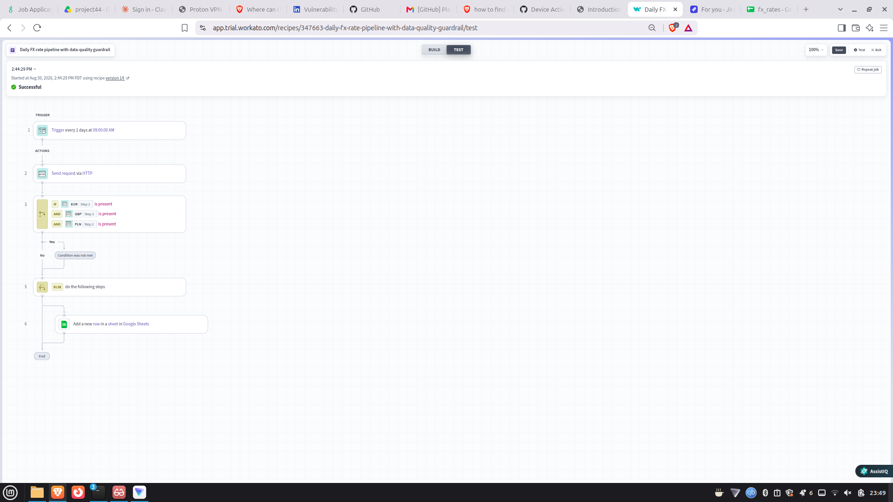
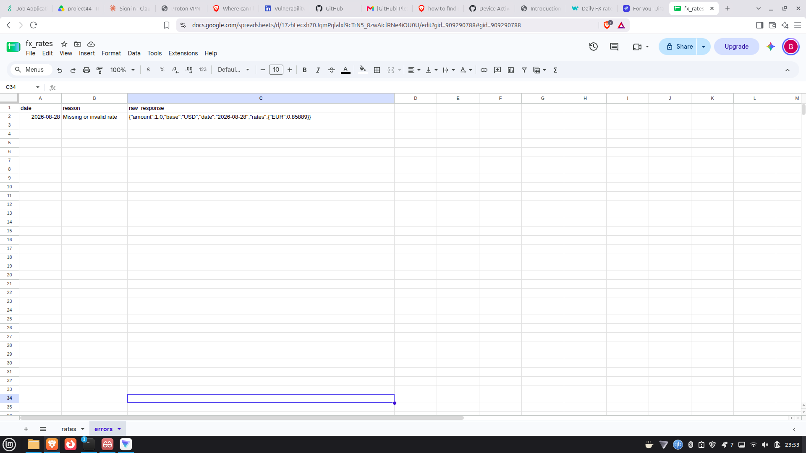

# Workato Recipe — Daily FX-rate pipeline with a data-quality guardrail

A Workato recipe that pulls foreign-exchange rates from a public REST API on a
schedule, runs a **data-quality check**, and appends clean rows to a Google Sheet —
routing incomplete data to an error tab instead of letting it through.

Built in a Workato trial workspace while working through Workato Academy
("Applied Gen AI in Workato", certified).

## What it demonstrates

- **Scheduled trigger** — runs the pipeline daily, unattended
- **REST/HTTP action** — authenticated call to a public FX API (`api.frankfurter.app`, no key)
- **JSON parsing** — response schema generated from a sample, exposing the rate fields
- **Data-quality guardrail** — an IF that checks **every expected rate is present**
  (`EUR is present AND GBP is present AND PLN is present`)
- **Conditional routing** — matching data → `rates` tab; incomplete data → ELSE → `errors` tab
- **Error visibility** — the `errors` row stores the reason and the raw API response

This mirrors the "compliance data pipelines" and "production safeguards including …
data-quality checks" an internal automation platform runs between systems.

## Screenshots

**The recipe** — trigger → HTTP → IF → ELSE:

**The data-quality conditions** — all three rates must be present (AND):

**A successful run taking the ELSE path** — a rate was missing, so the guardrail routed
to the error branch (note "Condition was not met"):

**The guardrail catching bad data** — the `errors` tab row, whose `raw_response` shows
only `EUR` came back (GBP/PLN missing), which is exactly why it was flagged:

## How it was built

Step-by-step build notes — including the two bugs I hit and how I fixed them — are in
[BUILD.md](BUILD.md).

## Design notes

- **Presence check, not a value check.** I first wrote the conditions as `rate > 0`, but
  when the API omits a currency entirely, Workato can't evaluate `> 0` on a missing field
  and the recipe *errors* instead of routing to the error branch. Switching to
  **`is present`** makes missing fields fail gracefully into the ELSE path — and it's the
  more accurate data-quality question ("did every expected rate come back?").
- **AND, not OR.** The three conditions are joined with **AND** so *all* rates must be
  present; with OR, a single present rate would wrongly pass the check.
- Uses only free/standard connectors (Scheduler, HTTP, Google Sheets) and a public,
  no-auth API — nothing proprietary, no real credentials stored anywhere.
